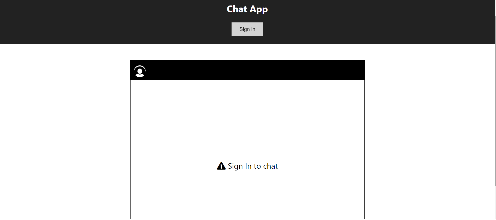
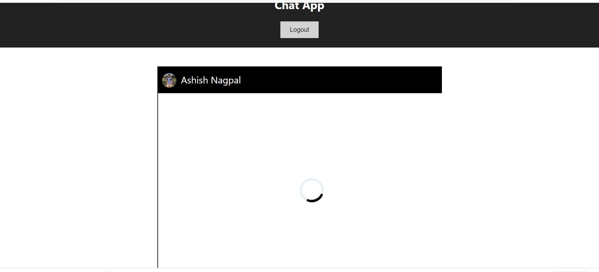
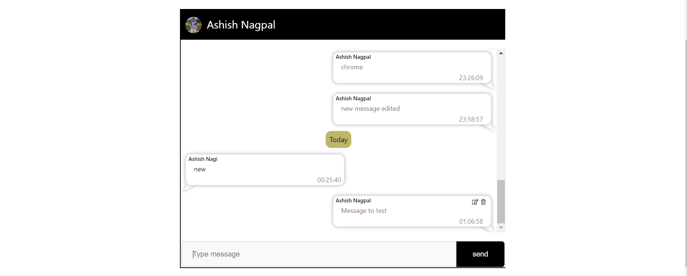
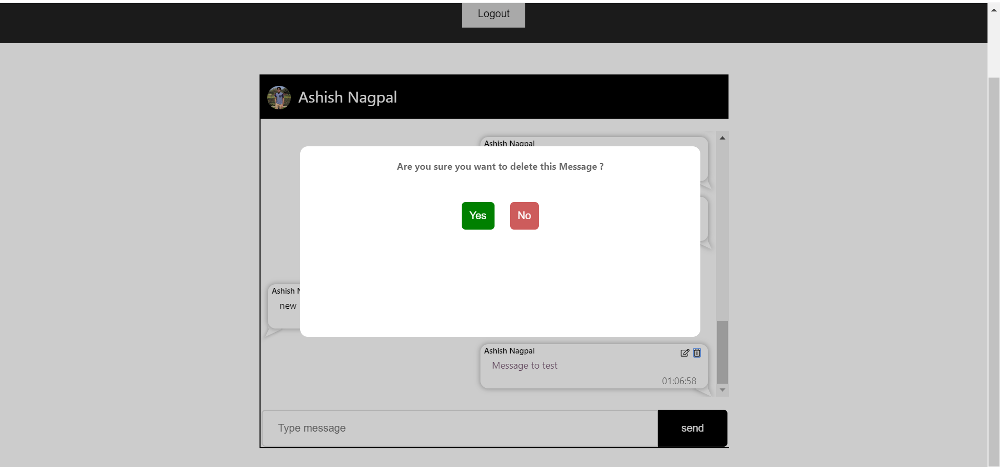
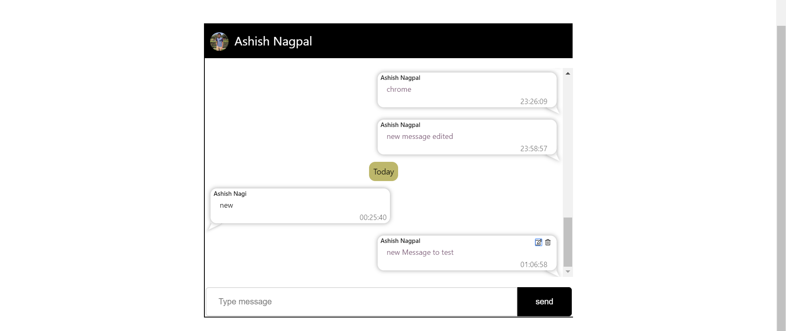

### Project Features
* Instant Messaging over the Application
* Push Notification
* Assigned Different Colors to Users
* Edit / Delete Message Feature Within 1 hour of message send

### Project Learning 
* Firebase firestore and storage
* Firebase Messaging
* Web Workers and Push API

### Configration Setup
* Install firebase-tools
* Clone app
* Create a firebase project in google console and enable firestore
* Enable Messaging API 

##### Initial Screen of the Web App

##### Loading Screen After Authentication

##### App

##### Delete Message Confirmation

##### Final Message Edited

